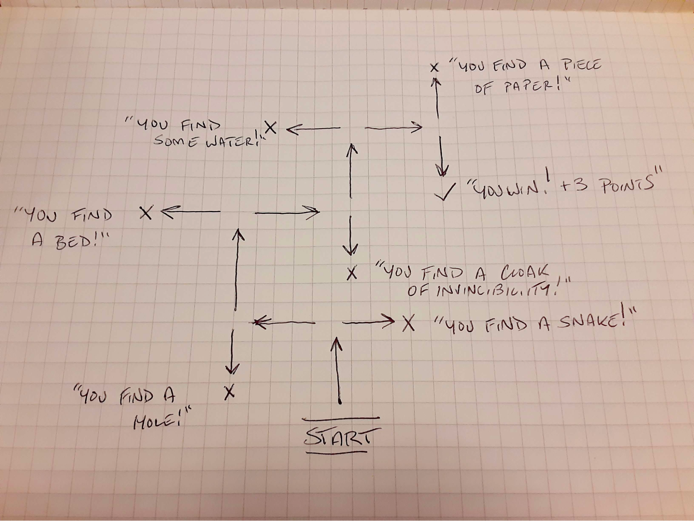

> **If you haven't already, please make sure to read the [Etiquette](../etiquette).**

## Episode Questions/Answers/Results

**Start of Loop**

|     |
| --- |
| **Q1** | **What chemical element has the atomic number 87?** |
| **A1** | Francium |

|     |
| --- |
| **Q2** | **What is the capital of Burkina Faso?** |
| **A2** | Ouagadougou [12.3014364,-1.5135555, 12°18'05.2"N 1°30'39.5"W] |

|     |
| --- |
| **Q3** | **Who won the Nobel Prize in Literature in 1970?** |
| **A3** | Aleksandr Solzhenitsyn |

|     |
| --- |
| **Q4** | **What HTML HEX code is this?** |
| **A4** | #D2993D |

| **Loop** | 1 | 2 | 3 | 4 | 5 |
| --- |
| **Q5** | **Name a Keanu Reeves movie (no repeats)** |
| **A5** | Speed | The Matrix | Bill and Ted’s Excellent Adventure | John Wick | Bram Stoker’s Dracula |

| **Loop** | 1 | 2 | 3 | 4 | 5 |
| --- |
| **Q6** | X = 3 + 5 | X = 3 + 5 | Y = X - 2 | Z = X - Y | A = X + Y + Z |
| **A6** | X = 8 | X = 8 | Y = 6 | Z = 2 | A = 16 |
| **KEYS**  | X = 8 | Y = 6 | Z = 2 | A = 16 |

|     |
| --- |
| **Q7** | **Solve the “Game Changer” video game maze** |
| **A7** | Left, right, right, left, right, right [+3 points] |
| **More Info** | **GAME LINK:** [https://colinw.itch.io/gcdjv](https://colinw.itch.io/gcdjv) (Password is GC123) *[Link shared by Sam Reich](https://discord.com/channels/468488285686202369/619315374277656577/1232119483217477653)* |

(From discord user James (fey_wild)):  

|     |
| --- |
| **Q8** | **Count the beans** |
| **A8** | 7,592 |
| | ***Mike*** | ***Ify*** | ***Siobhan*** |
| **Loop 1** | 352 | 671 | 1,500 [+1] |
| **Loop 2** | 1,265 | 1,501 | 1,650 [+1] |
| **Loop 3** | 2,001 [+1] | 2,000 | 1,750 |
| **Loop 4** | 2,501 | 2,650 [+1] | 2,500 |
| **Loop 5** | 5,013 [+1] | 5,012 | 5,011 |

|     |
| --- |
| **Q9** | **Gimme a duck** |
| **A9** | You need to give a rubber duck, all other duck forms score no point |
| | ***Mike*** | ***Ify*** | ***Siobhan*** |
| **Loop 1** | Duck [+1] | Duck [+1] | Duck [+1] |
| **Loop 2** | Drawing | Drawing | Drawing |
| **Loop 3** | Duck [+1] | Duck [+1] | - |
| **Loop 4** | - | Duck [+1] | Duck [+1] |
| **Loop 5** | Duck | p [+3] | Duck |

|     |
| --- |
| **Q10** |  |
| **A10** |  |

|     |
| --- |
| **Q11** |  |
| **A11** |  |

|     |
| --- |
| **Q12** |  |
| **A12** |  |

|     |
| --- |
| **Q13** |  |
| **A13** |  |

|     |
| --- |
| **Q14** |  |
| **A14** |  |

|     |
| --- |
| **Q15** |  |
| **A15** |  |

|     |
| --- |
| **Q16** |  |
| **A16** |  |