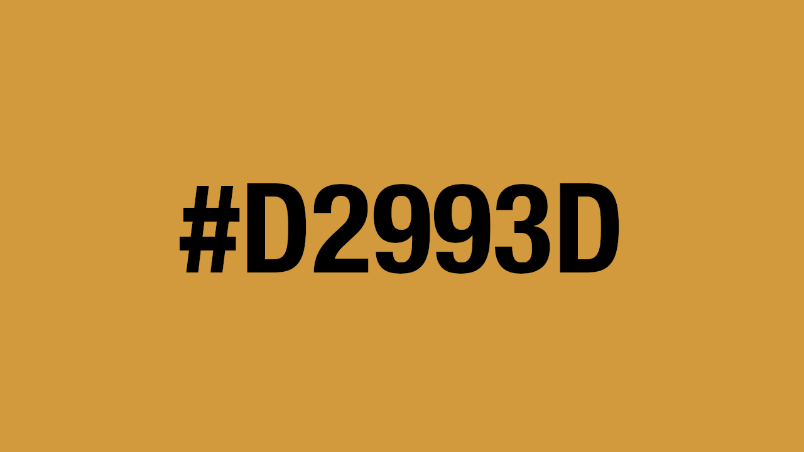

> **If you haven't already, please make sure to read the [Etiquette](../etiquette).**

## Episode Details

**Title:** Deja Vu  
[Season 6, Episode 6](https://www.dropout.tv/game-changer/season:6/videos/deja-vu) • April 22, 2024  

## Question \#4 (HTML HEX Code)

### Additional Details
**HEX value:** #D2993D  
**RGB value:** 210, 153, 61  
**CMYK value:** 0, 27, 71, 18  
**Decimal value:** 13801789

### Theories
- (From Discord user ***Kiloku***): Color codes are Hexadecimal triplets. Each pair of digits goes from 00 to FF, which are equivalent to 0 and 255 in decimal notation. D2 converts to 210. 99 converts to 153. 99 converts to 61. Does 210 153 61 mean anything?
- (From Discord user ***the lizard king***): “idk if this is anything but i tried just converting each hex place to its corresponding decimal so d -> 13, 2 -> 2, 9 -> 9 and so on. and then just to throw everything at the wall i converted that to the alphabet with a simple a-> 1, b->2, c -> 3 to get mbiicm”
- The color code is sandwiched. Do we have any ideas on “DD” or “2993” ?